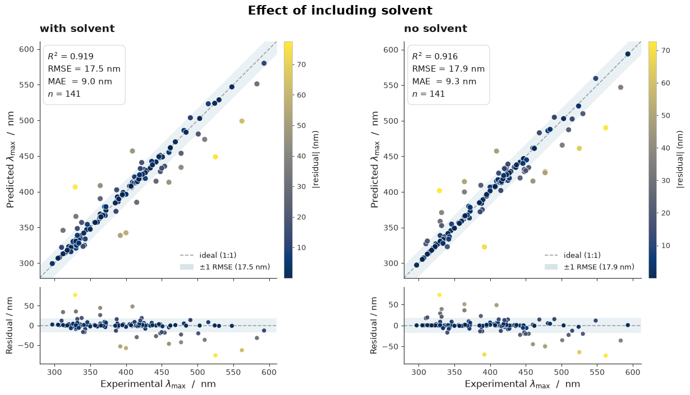
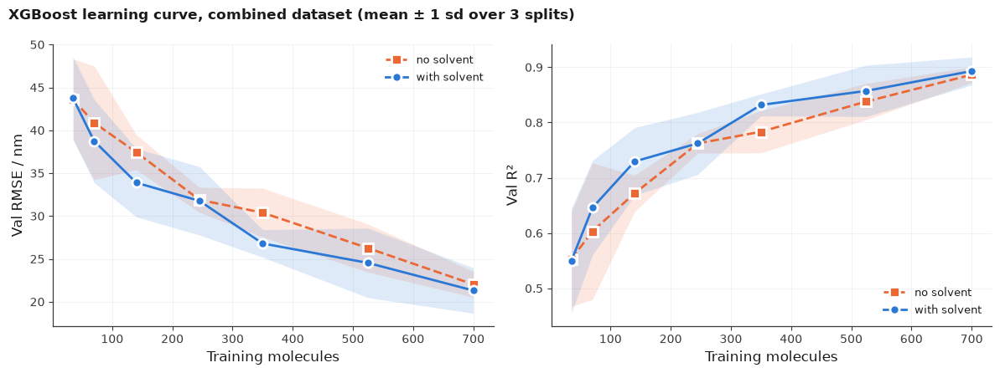
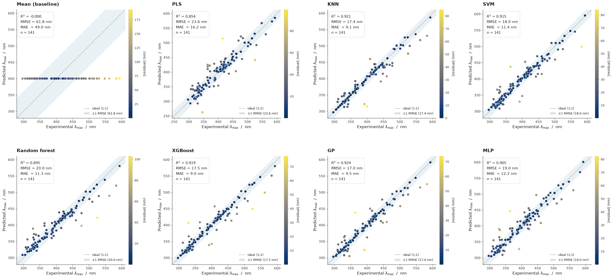
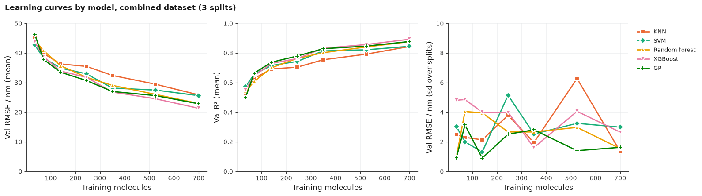
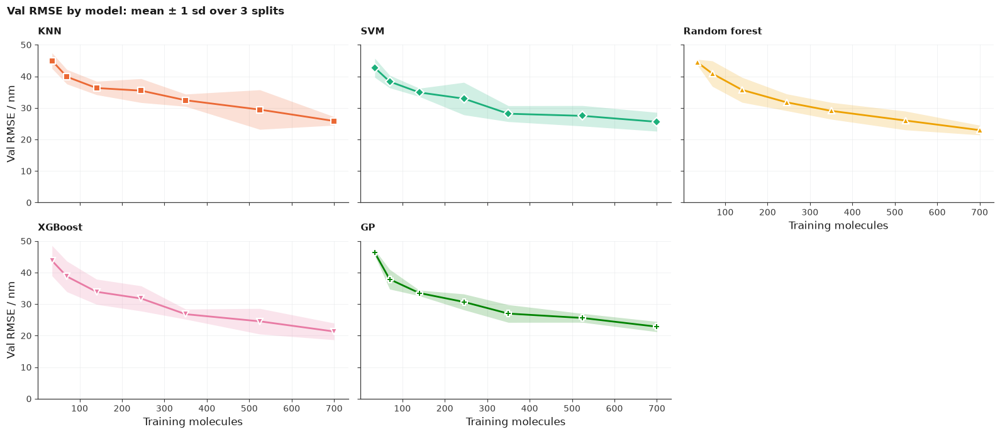

# ChemRover results: azobenzene λmax prediction

**Setup (all sections unless stated):** combined dataset (subset 4), split into 700 train / 93 test (hyper-parameter tuning) / 141 val (final benchmark). Metrics are on the val split. Features are the 217 RDKit descriptors, plus solvent (218 features) where included.

---

## 1. Repeated optimisation over different seeds

The model was refitted over 5 different split seeds to check how much the results vary with sampling.

| | RMSE / nm | MAE / nm | R² |
|---|---:|---:|---:|
| Mean | 22.8 | 12.5 | 0.883 |
| Std | 3.0 | 1.6 | 0.029 |

- The split alone moves R² by ±0.029; smaller differences are not meaningful.
- The default split (seed 42) is favourable: RMSE 17.5 nm vs a 22.8 nm average over seeds (0-4).

---

## 2. Solvent vs no solvent

| Features | RMSE / nm | MAE / nm | R² |
|---|---:|---:|---:|
| With solvent | 17.5 | 9.0 | 0.919 |
| No solvent | 17.9 | 9.3 | 0.916 |

- Solvent gives a marginal gain (ΔR² = 0.003), smaller than the split-to-split noise (σ = 0.029).
- Looks like same outlier points in both cases. May be a data issue to flag. Check against the models comparisons ...

---

## 3. Learning curve by solvent

XGBoost model with RDKit descriptors on the largest (combined) dataset. Mean ± 1 std over the split seeds.

| Training molecules | RMSE / nm, no solvent | RMSE / nm, with solvent | MAE / nm, no solvent | MAE / nm, with solvent | R², no solvent | R², with solvent |
|---:|---:|---:|---:|---:|---:|---:|
| 35 | 43.6 ± 4.7 | 43.7 ± 4.8 | 30.6 ± 3.5 | 31.4 ± 4.4 | 0.553 ± 0.085 | 0.550 ± 0.095 |
| 70 | 40.9 ± 6.6 | 38.8 ± 4.9 | 27.8 ± 5.1 | 27.3 ± 5.3 | 0.603 ± 0.124 | 0.646 ± 0.085 |
| 140 | 37.4 ± 2.1 | 33.9 ± 4.0 | 23.3 ± 1.6 | 22.5 ± 2.9 | 0.672 ± 0.033 | 0.729 ± 0.061 |
| 245 | 31.9 ± 1.5 | 31.8 ± 4.0 | 19.8 ± 1.3 | 20.4 ± 3.0 | 0.762 ± 0.018 | 0.762 ± 0.056 |
| 350 | 30.4 ± 2.9 | 26.8 ± 1.6 | 18.3 ± 2.6 | 16.1 ± 0.9 | 0.783 ± 0.038 | 0.832 ± 0.020 |
| 525 | 26.3 ± 2.8 | 24.5 ± 4.1 | 14.8 ± 1.0 | 14.3 ± 2.4 | 0.838 ± 0.033 | 0.857 ± 0.046 |
| 700 | 22.0 ± 1.5 | 21.3 ± 2.6 | 11.8 ± 0.1 | 12.4 ± 2.0 | 0.886 ± 0.014 | 0.893 ± 0.025 |

- Solvent lowers RMSE at 5 of 7 sizes, but always within ±1 std.
- Accuracy is still improving at 700 molecules: more data should help.

---

## 4. Comparison of model architectures

| Model | RMSE / nm | MAE / nm | R² |
|---|---:|---:|---:|
| GP | 17.0 | 9.5 | 0.924 |
| KNN | 17.4 | 9.1 | 0.921 |
| XGBoost | 17.5 | 9.0 | 0.919 |
| SVM | 18.0 | 11.4 | 0.915 |
| MLP | 19.0 | 12.2 | 0.905 |
| Random forest | 20.0 | 11.3 | 0.895 |
| PLS | 23.6 | 16.2 | 0.854 |
| Mean (baseline) | 61.8 | 49.0 | 0.000 |

| Abbreviation | Model |
|---|---|
| GP | Gaussian process |
| KNN | k-nearest neighbours |
| SVM | Support vector machine |
| MLP | Multilayer perceptron |
| PLS | Partial least squares regression |
| Mean (baseline) | Always predicts the training mean |

- GP, KNN, XGBoost and SVM are tied (R² 0.915–0.924, a spread below the split noise).
- PLS is the weakest real model (R² 0.854)
- All models far outperform the mean baseline as expected.
- Single split only. Need to confirm the ranking over several seed splits

---

## 5. Learning curve by model architecture

Each model was refitted at 7 training-set sizes over 3 split seeds. Values are mean ± 1 sd over the splits.

**Val RMSE / nm by training-set size**

| Model | 35 | 70 | 140 | 245 | 350 | 525 | 700 |
|---|---:|---:|---:|---:|---:|---:|---:|
| XGBoost | 43.7 ± 4.8 | 38.8 ± 4.9 | 33.9 ± 4.0 | 31.8 ± 4.0 | 26.8 ± 1.6 | 24.5 ± 4.1 | 21.3 ± 2.6 |
| GP | 46.3 ± 0.9 | 37.9 ± 3.1 | 33.5 ± 0.9 | 30.7 ± 2.5 | 27.0 ± 2.8 | 25.6 ± 1.4 | 22.8 ± 1.6 |
| Random forest | 44.4 ± 1.0 | 40.8 ± 4.0 | 35.7 ± 4.0 | 31.8 ± 2.7 | 29.1 ± 2.7 | 26.0 ± 3.0 | 23.0 ± 1.5 |
| SVM | 42.7 ± 3.0 | 38.3 ± 2.0 | 34.9 ± 1.3 | 32.9 ± 5.1 | 28.1 ± 2.5 | 27.5 ± 3.2 | 25.6 ± 3.0 |
| KNN | 45.0 ± 2.5 | 39.9 ± 2.3 | 36.3 ± 2.1 | 35.5 ± 3.8 | 32.4 ± 1.9 | 29.4 ± 6.3 | 25.8 ± 1.3 |
| PLS | unstable* | unstable* | unstable* | unstable* | unstable* | unstable* | 28.8 ± 4.9 |
| MLP | unstable* | unstable* | unstable* | unstable* | unstable* | unstable* | 79.5 ± 92.4 |

**Full training set (700 molecules)**

| Model | RMSE / nm | MAE / nm | R² |
|---|---:|---:|---:|
| XGBoost | 21.3 ± 2.6 | 12.4 ± 2.0 | 0.893 ± 0.025 |
| GP | 22.8 ± 1.6 | 11.5 ± 0.8 | 0.878 ± 0.018 |
| Random forest | 23.0 ± 1.5 | 13.5 ± 0.5 | 0.876 ± 0.016 |
| SVM | 25.6 ± 3.0 | 14.8 ± 1.9 | 0.845 ± 0.039 |
| KNN | 25.8 ± 1.3 | 12.9 ± 0.6 | 0.844 ± 0.013 |
| PLS | 28.8 ± 4.9 | 18.2 ± 2.4 | 0.802 ± 0.072 |
| MLP | 79.5 ± 92.4 | 21.6 ± 10.0 | −1.76 ± 4.51 |

\*At least one split diverges. RMSE runs into the hundreds or thousands of nm, R² is strongly negative, and the sd is larger than the mean.

- **Small data:** At 35 molecules, every stable model sits at 43–46 nm (R² 0.50–0.57), and none pulls ahead.
- **Full data:** XGBoost, GP and random forest are within 1 sd of each other at 700 molecules. SVM and KNN are about 4 nm worse.
- **Ranking changes from section 4:** Averaged over 3 splits, KNN drops from 2nd to 5th, and every model does worse than on the single seed-42 split (e.g. GP 22.8 vs 17.0 nm). This supports the earlier finding that seed 42 is a favourable split.
- **Still improving:** Every stable model is still improving at 700 molecules, the same as in section 3.
- **PLS and MLP are unstable** below 700 molecules, and MLP is unstable even at 700. This looks like a fitting problem rather than a real result (e.g. feature scaling, or descriptors with extreme values).
- The five stable models stay within about 4–5 nm of each other at every size.
- RDkit FP may be such a strong indicator of absorbance that model selection is not be heavily impactful 

> Extreme value ranges of the RDKit descriptors (e.g. [Ipc values can baloon](https://github.com/rdkit/rdkit/issues/1527))
may be causing issues with the MLP and PLS and may need trimming. Can be done in scikit-fingerprints with 'clip_val' so
will test this once sk-fp is installed.

---

## 6. differences in encoding

*In Progress...*
